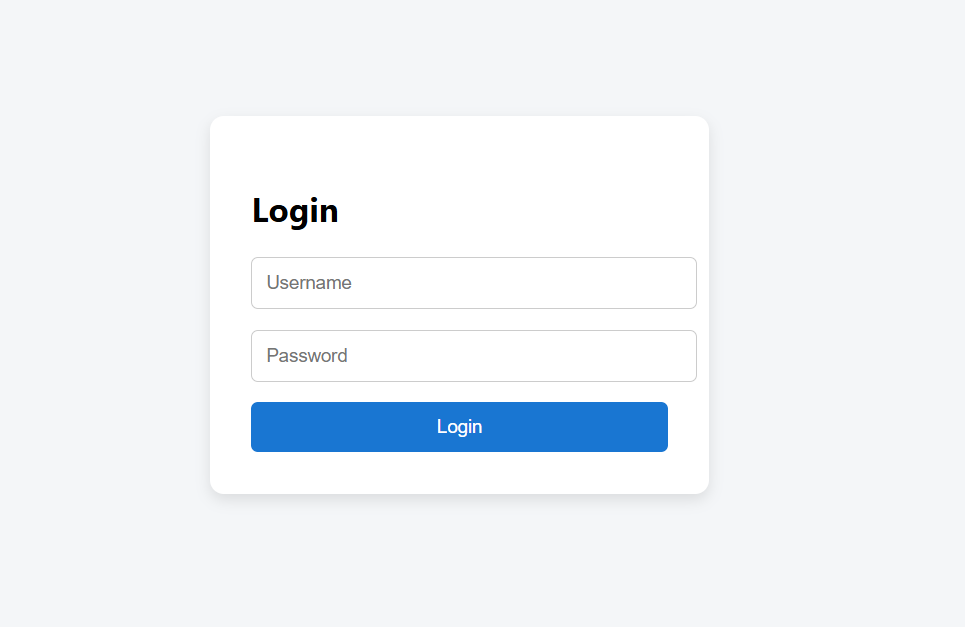
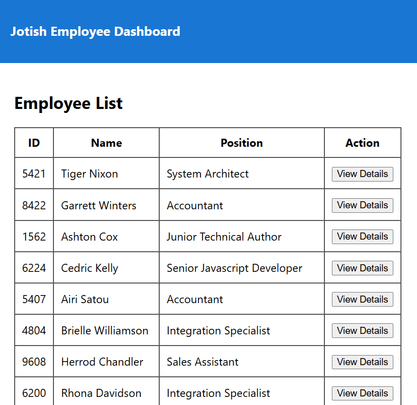
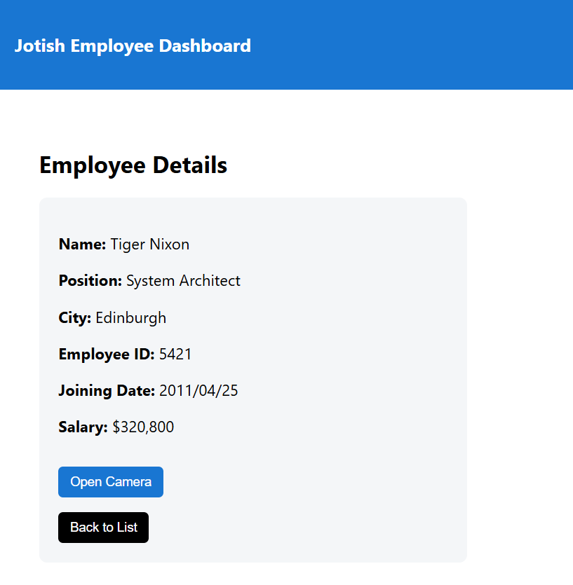
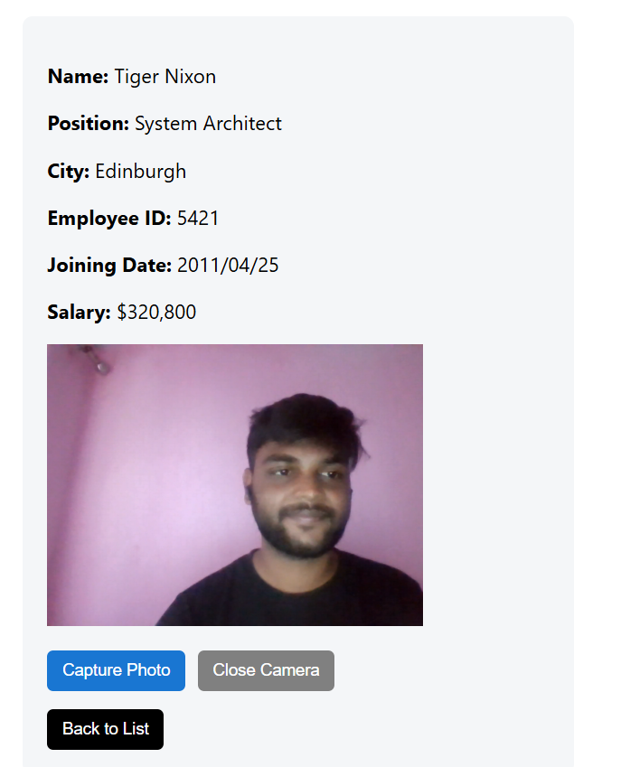
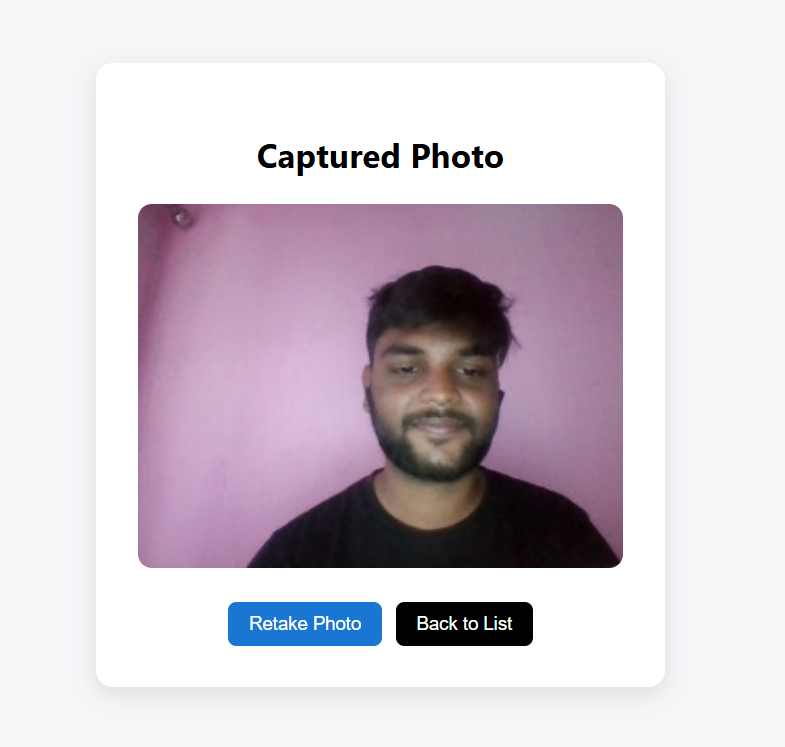
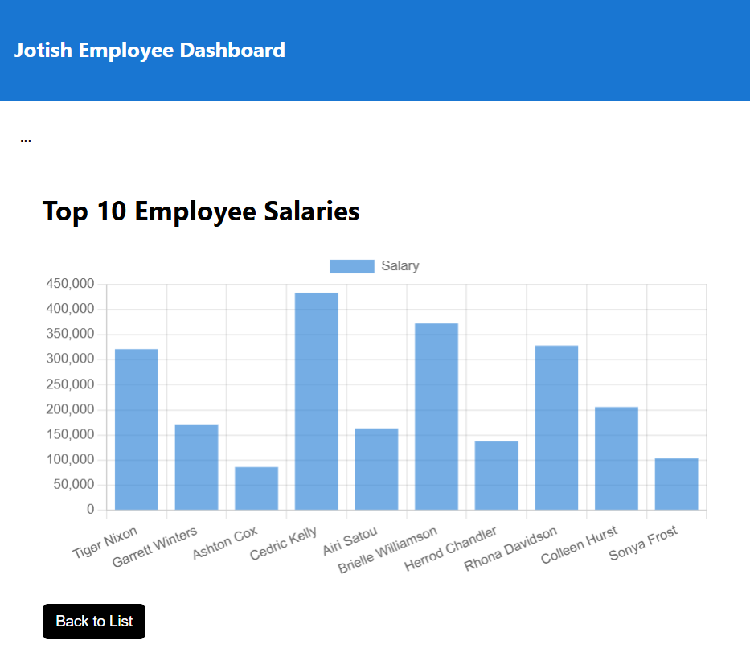
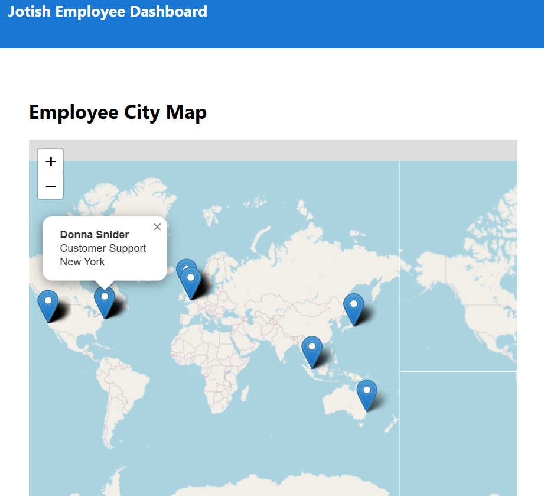

# Jotish ReactJS Internship Assignment

## 🌐 Live Demo
https://jotish-react-assignment.vercel.app

## 🔐 Login Credentials
Username: testuser 
Password: Test123 

---

## 🚀 Project Overview

This is a ReactJS application developed as part of the Jotish Internship Assignment.

The application includes:

- Login Authentication
- Employee List (API Integration via POST request)
- Employee Details Page
- Camera Capture using React Webcam
- Photo Result Display
- Salary Bar Chart (Top 10 Employees)
- City Map Visualization using React Leaflet

---

## 🛠 Tech Stack Used

- ReactJS
- React Router DOM
- Axios
- Chart.js
- React Webcam
- React Leaflet
- Leaflet Maps

---

## 📦 API Used

The application consumes data from:

https://backend.jotish.in/backend_dev/gettabledata.php

In production, a Vercel serverless function is used to handle API requests and resolve CORS issues.

Request Body:
{
  "username": "test",
  "password": "123456"
}

---

## ▶️ How to Run the Project

1. Clone the repository
2. Run: npm install
3. Run: npm start
4. Open: http://localhost:3000

---

## 📸 Application Screenshots

### 🔐 Login Page

### 📋 Employee List

.png)

### 👤 Details Page

### 📷 Camera

### 🖼 Captured Image

### 📊 Salary Chart

### 🗺 City Map

## 🎥 Screen Recording

[Click here to watch full demo video](https://drive.google.com/file/d/1STFGpTnHWPy3JEUaiggJaKwt7cVNhrE1/view?usp=sharing)

---

## 📌 Additional Highlights

- Clean folder structure
- Feature-based git commits
- Proper error handling
- Responsive UI
- Index-based API data handling

---

## 👨‍💻 Developed By

Shishir Mahato